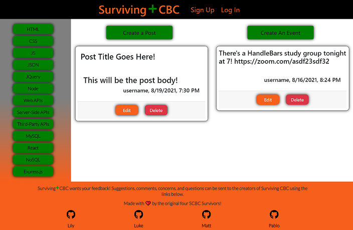

# **Surviving+CBC**–Group Project 3 of 3

Please visit the deployed application by clicking the following link: [**Surviving-CBC**](https://survivingcbc.herokuapp.com/).  
The original repository can be viewed here: [**Surviving+CBC**](https://github.com/lilyhi/surviving-cbc).  
My forked copy of the repository can be viewed here: [**Surviving+CBC**](https://github.com/lilyhi/surviving-cbc).

### Table of Contents

-   [Contributors](#contributors)
-   [Description](#description)
-   [Usage](#usage)
-   [Future Developments](#future-developments)

## Contributors

Made with ❤️️ by the original four **S+CBC** Survivors!

> -   [**Lily**](https://github.com/lilyhi)
> -   [**Luke**](https://github.com/Shilohjones194)
> -   [**Matt**](https://github.com/LifeInvaderr)
> -   [**Pablo**](https://github.com/pablodlc)

I was on the front-end team, handling the views. In an early meeting, we drafted a wireframe to structure our page. My primary contribution was structuring the views and styling with React, and helping structure the front-end router.

## Description

This group project is a full-stack social network application intended for boot camp students and alumni. Our concept came to us relatively quickly. The inspiration being prospective coding boot camp survivors ourselves. We decided to develop a two-fold application: a way for boot camp classmates to keep in touch while growing a welcoming development community and to be a resource where users can interact and help each other with programming questions.

**Surviving+CBC** ("**S+CBC**") features authentication for sign up and log in functionality and is powered by MongoDB to store `User`, `Post`, and `Event` data, which are broken into `Subject`s. In the leftmost column on the homepage is a column of buttons with `Subject`s as their text content. Clicking on these `Subject` buttons will update the second column to display a series of `Post`s related to the `Subject` button, and the third column a series of related `Event`s. `Post`s are the social aspect of `S+CBC`, intended for sharing small bits of information with other users or for scheduling `Event`s. `Event`s are meant for posting details about study sessions or seminars related to the active `Subject` button, along with times, location and pertinent links.

## Usage

Navigate to the application here: [**Surviving-CBC**](https://survivingcbc.herokuapp.com/).  
There are several buttons with `Subject`s as their text content. Clicking on them will display `Post`s about the `Subject` in the second column and related `Event`s in the third column. All of the page content can be viewed by anyone who accesses the page. However, only registered users can add a `Post` or `Event`. To sign up as a user, or survivor, the user cab click on the `Sign Up` link in the `Navbar`, or navigate https://survivingcbc.herokuapp.com and append any of the following to the URL:

-   `/signup`
-   `/register`
-   `/iwillsurvive`

Once at the sign up page, the user needs to enter a username, a valid email address, and a password. When those three inputs are provided and the Submit button is clicked, the user is logged in, redirected to the homepage, and then can add `Post`s and `Event`s.

## Future Developments

Presently, **S+CBC** is unfinished. We struggled to connect the front and back ends, so none of the application's data can be interacted with or seen. That would be priority one.

The state of the app isn't reflected on the page. Next would be to add hooks in order to update the `Navbar` to say "Sign Up" and "Log In" when the user isn't logged in, and "Log Out" when the user is logged in.

The next step we discussed was to add reactions to `Post`s and `Event`s so that users can interact with one another.

After those steps are accomplished, we want to enable friending for users to make it easier to keep in touch with one another and find each others' activity more easily.

## Questions?

Please feel free to contact me with any questions or comments, or visit my GitHub to see more of my work.

-   [Contact me by email](mailto:pablodlc@gmail.com)
-   [GitHub profile: /pablodlc](https://github.com/pablodlc)
-   [Lily's original **Surviving+CBC** GitHub Repo](https://github.com/lilyhi/surviving-cbc)
-   [My forked copy of the **Surviving+CBC** GitHub Repo](https://github.com/pablodlc/surviving-cbc)
-   [Visit my portfolio!](https://pablodlc.github.io)
